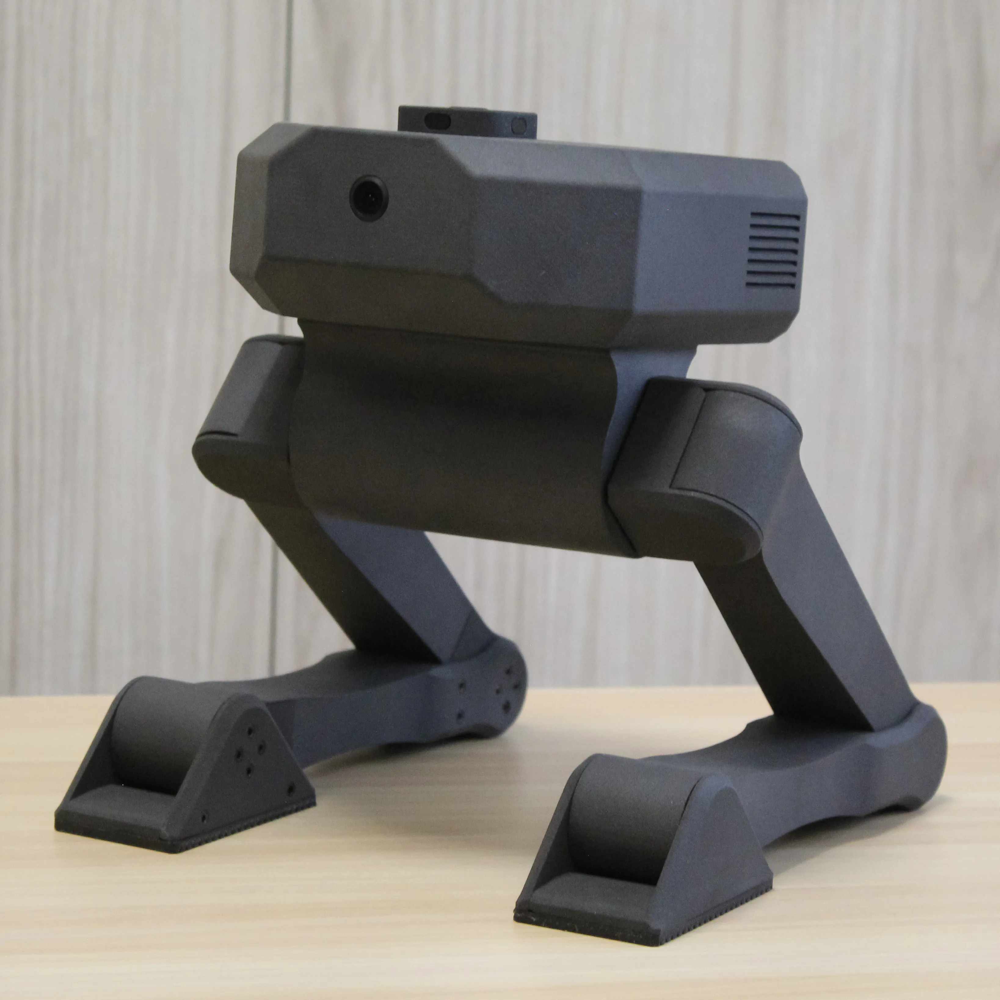

# Bimo Robotics Kit – Open-Source Bipedal Robotics Platform


Bimo is a **45 cm tall bipedal robot** created to democratize bipedal robotics research in a compact platform. Get started with pre-built kits or customize the design. Includes complete CAD files (coming soon), RP2040 firmware, Isaac Lab training environment, and a Python API for real-time control and model deployment

**[Product Page](https://www.mekion.com)** • **[Discord Community](https://discord.gg/9uXsArwXHG)** • **[Roadmap](https://www.mekion.com/project/#roadmap)**

---

### Key Highlights

- **Fully Open Source:** CAD files (coming soon), firmware, and code. Build, modify, and improve.
- **Sim-to-Real Ready:** Train policies in Isaac Lab, deploy directly on hardware.
- **Baseline Walking Model:** Deployed directly from simulation, without adaptation.
- **Community-Driven:** Share your implementations and improvements with the community.
- **Accessible Price:** High-quality kit at **$950** (SLS) or build your own DIY (FDM) edition.
- **Fast Training:** Vectorized Isaac Lab environments to train policies in <20 minutes (depends on hardware).


---

## Main Features & Specifications

| Feature | Specification |
|---------|---------------|
| **Height** | 45 cm |
| **Weight** | ~1.6 kg |
| **Actuators** | 8 servo motors (STS-3215) |
| **Sensors** | BNO08x 9-DOF IMU, 4× TOF distance sensors, 2x 180ºFOV Cameras |
| **Microcontroller** | Custom PCB, based on the RP2040 |
| **Communication** | Direct through USB |
| **Power** | 12V Includes adapters for different power supply |
| **Compute** | On-board MCU, offboard inference via Python API (compatible with SBCs)|
| **Design** | Hip-head biped for simpler mechanics, includes empty head volume for custom hardware |
| **Control Loop** | 20 Hz|

---

## What You Can Do

### 1. Train RL Policies
Use **Isaac Lab + RSL-RL** to train bipedal behaviors in simulation.

```bash
cd IsaacLab/
./isaaclab.sh -p scripts/reinforcement_learning/rsl_rl/train.py --task Bimo --num_envs 2048 --headless
```

Export trained policies as ONNX and run inference on your robot in real-time.

### 2. Deploy Pre-Programmed Routines
Control your robot with Python, no ML required.

```python
from bimo import Bimo, BimoRoutines

bimo = Bimo()
bimo.initialize()

routines = BimoRoutines()
routines.perform(bimo, "stand")
routines.perform(bimo, "sit")

# Or command servo positions directly
bimo.send_positions([0, 0, 0, 0, 60, 60, 30, 30])  # degrees
```

### 3. Contribute & Collaborate (Near Future)
- Add new routines or behaviors and submit to the community
- Improve sim-to-real transfer
- Optimize hardware design
- Write tutorials and documentation

---

## Repository Structure

```
the-bimo-project/
├── README.md                # Main project README
├── LICENSE                  # Apache 2.0
├── .gitignore
│
├── BimoAPI/                 # Python control library
│   ├── setup.py             # Package setup (mekion-bimo)
│   ├── README.md            # BimoAPI documentation
│   ├── bimo/
│   │   ├── __init__.py
│   │   ├── bimo.py          # Core Bimo control class
│   │   └── routines.py      # Pre-programmed behaviors
│   └── examples/
│       └── api_example.py   # Complete inference example
│
├── IsaacLab/                # RL training environment
│   ├── README.md            # Training guide
│   └── bimo/
│       ├── __init__.py
│       ├── bimo_config.py   # Robot & actuator configuration
│       ├── bimo_task_env.py # Full Isaac Lab task environment
│       ├── agents/
│       │   ├── __init__.py
│       │   └── rsl_rl.py    # RSL-RL PPO hyperparameters
│       └── assets/
│           └── BimoUSD/     # USD robot model
│
└── MCU/                     # Microcontroller firmware
    ├── README.md            # MCU protocol & setup
    └── micro_bimo.ino       # RP2040 firmware (Arduino IDE)

```

---

## Roadmap

**Q4 2025:**
- Walking policy direct sim-to-real transfer
- Turn and Stop (push survival) in progress

**Q1-Q2 2026:**
- CE/FCC Certification

**Late Q2 2026:**
- First kits ship: SLS, DIY options available
- Community development
- Manuals, DIY assembly tutorials, CAD models

**Q3 2026:**
- R&D Team Constitution
- Project Maintenance & Development
- Contribution setup

---

## License

All code and CAD designs are, and will, be released under the **Apache 2.0 License**. See [LICENSE](LICENSE) for details.

---

## Links

- **Website:** [Mekion](https://www.mekion.com)
- **GitHub:** [github.com/mekion/the-bimo-project](https://github.com/mekion/the-bimo-project)
- **Discord:** [Join Community](https://discord.gg/9uXsArwXHG)
- **Issues & Discussions:** [GitHub Issues](https://github.com/mekion/the-bimo-project/issues)

---

## Contact

For questions, partnerships, or press inquiries:
- **Email:** info@mekion.com
- **X(Twitter):** [@mekionlabs](https://x.com/mekionlabs)

---

**Built with ❤️ by [Mykhaylo Ilyin](https://www.linkedin.com/in/mkiln). Making bipedal robots accessible.**

---
