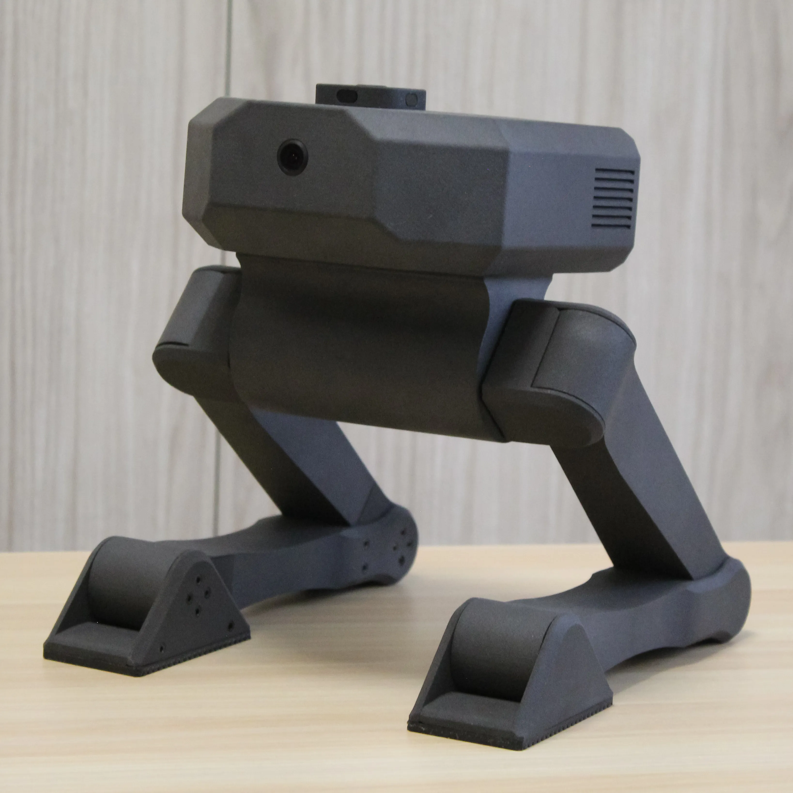
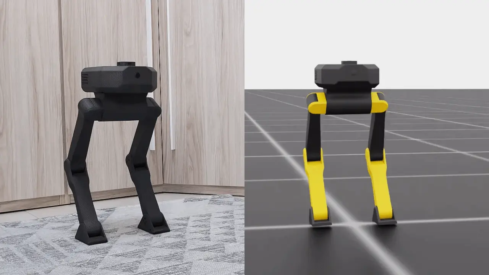

# Bimo Robotics Kit – Open-Source Bipedal Robotics Platform


Bimo is an **open-source bipedal robot** created to make bipedal robotics research more accessible in a compact platform. Get started with pre-built kits or customize the design. Includes complete CAD files (coming soon), RP2040 firmware, Isaac Lab training environment, and a Python API for real-time control and model deployment.

[](https://oosmetrics.com/repo/mekion/the-bimo-project)

**[Product Page](https://www.mekion.com)** • **[Discord Community](https://discord.gg/9uXsArwXHG)**

---

### Key Highlights

- **Fully Open Source:** CAD files (coming soon), firmware, simulation and deployment code.
- **Sim-to-Real Ready:** train policies in Isaac Lab, deploy directly on hardware.
- **Baseline Walking Model:** deployed directly from simulation, without adaptation.
- **Two Configurations:** available as a fully assembled SLS kit or a DIY 3D-printable edition.
- **Fast Training:** vectorized Isaac Lab environment to train policies in <15 minutes (depends on hardware).



---

## Main Features & Specifications

| Feature | Specification |
|---------|---------------|
| **Height** | 45 cm |
| **Weight** | ~1.6 kg |
| **Actuators** | 8 servo motors (STS-3215) |
| **Sensors** | BNO08x 9-DOF IMU, 4× TOF distance sensors, 2x 180ºFOV Cameras |
| **Controller** | Custom RP2040-based board compatible with SBCs through data and power connectors |
| **Communication** | USB 2.0 (PC or SBC) |
| **Power** | 9V-13V. Includes adapters to Banana Plugs and Power Jack. Sold without battery: battery-compatible |
| **Compute** | Offboard on PC, or onboard using an SBC mounted inside the head |
| **Design** | Hip-head biped. Empty head cavity with 4 x M3 mounting points, designed to house an SBC or custom hardware|
| **Control Loop** | 20 Hz|

---

## Quick Start Guide

> **Prerequisites:** This guide assumes you have an SLS kit (fully assembled, firmware pre-loaded) or a completed DIY build with firmware already flashed. If not, see the [MCU Instructions](MCU/README.md) for flashing instructions.


### Step 1: Install the Python API

```bash
cd BimoAPI/
pip install -e .
```

See [BimoAPI](BimoAPI/README.md) for full API documentation.


### Step 2: Stand Up & Verify

Write a minimal Python script to test basic functionality:

```python
from bimo import Bimo

bimo = Bimo()
bimo.initialize()  # Connects MCU + cameras, moves to sit, calibrates IMU
bimo.perform("stand")
```

> **DIY Kit:** Run `bimo.initialize(calibrate=True)` on first use to calibrate servos. See the DIY Manual (coming soon) for full assembly and calibration instructions.


### Step 3: Train & Test Walking Model

Follow the [IsaacLab Instructions](IsaacLab/README.md), then train the walking model:

```bash
cd IsaacLab/
./isaaclab.sh -p scripts/reinforcement_learning/rsl_rl/train.py --task Bimo --num_envs 2048 --headless
```

Export the trained policy as ONNX, then deploy using the `api_example.py` script:

```python
import onnxruntime as ort
from bimo import Bimo

bimo = Bimo()
bimo.initialize()
bimo.perform("stand")
bimo.lock_heading()  # Required for walking model

session = ort.InferenceSession("policy.onnx",
    providers=["CUDAExecutionProvider", "CPUExecutionProvider"])

# See BimoAPI/examples/api_example.py for the full inference loop
```

---

## Repository Structure

```
the-bimo-project/
├── README.md                # Main project README
├── LICENSE                  # Apache 2.0
├── .gitignore
│
├── BimoAPI/                 # Python control library
│   ├── setup.py             # Package setup (mekion-bimo)
│   ├── README.md            # BimoAPI documentation
│   ├── CHANGELOG.md         # BimoAPI version history
│   ├── bimo/
│   │   ├── __init__.py
│   │   ├── bimo.py          # Core Bimo control class
│   │   └── routines.py      # Pre-programmed behaviors
│   └── examples/
│       └── api_example.py   # Complete inference example
│
├── IsaacLab/                # RL training environment
│   ├── README.md            # Training guide
│   └── bimo/
│       ├── __init__.py
│       ├── bimo_config.py   # Robot & actuator configuration
│       ├── bimo_task_env.py # Full Isaac Lab task environment
│       ├── agents/
│       │   ├── __init__.py
│       │   └── rsl_rl.py    # RSL-RL PPO hyperparameters
│       └── assets/
│           └── Bimo.usd     # USD robot model
│
└── MCU/                     # Microcontroller firmware
    ├── README.md            # MCU protocol & setup
    ├── CHANGELOG.md         # MCU version history
    └── micro_bimo.ino       # RP2040 firmware (Arduino IDE)

```

---

## Roadmap
**Q1-Q2 2026:**
- Community development
- Progressive Bimo updates
- CE/FCC Certification

**Q3 2026:**
- First kits ship: SLS, DIY options available
- Manuals, DIY assembly tutorials, CAD models

**Q4 2026:**
- R&D Team Constitution
- Project Maintenance & Development
- Contribution setup

---

## Partners & Supporters

| Organization | Details |
| --- | --- |
|  | [EOI](https://www.eoi.es): Escuela de Organización Industrial |
|  | [JLCCNC](https://jlccnc.com): High quality CNC machining services |

---

## License

All code and CAD designs are, and will, be released under the **Apache 2.0 License**. See [LICENSE](LICENSE) for details.

---

## Links

- **Website:** [Mekion](https://www.mekion.com)
- **GitHub:** [github.com/mekion/the-bimo-project](https://github.com/mekion/the-bimo-project)
- **Discord:** [Join Community](https://discord.gg/9uXsArwXHG)
- **Issues & Discussions:** [GitHub Issues](https://github.com/mekion/the-bimo-project/issues)

---

## Contact

For questions, partnerships, or press inquiries:
- **Email:** info@mekion.com
- **X(Twitter):** [@mekionlabs](https://x.com/mekionlabs)

---

**Built with ❤️ by [Mykhaylo Ilyin](https://www.linkedin.com/in/mkiln). Making bipedal robots accessible.**

---
