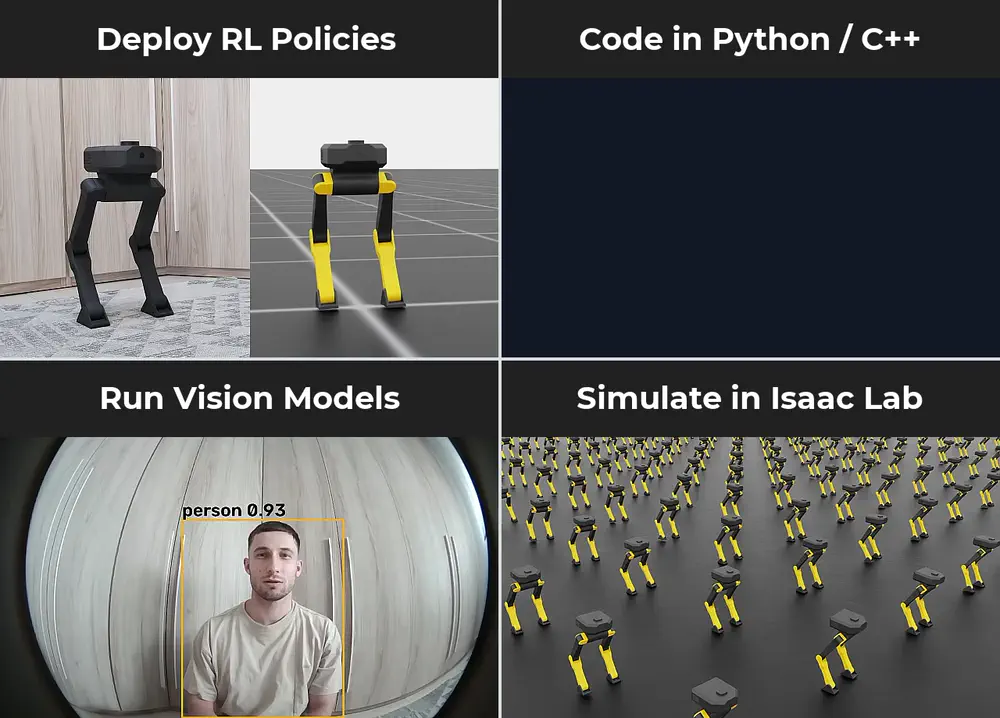

<div align="center">
  


# Bimo Robotics Kit
  
*Bimo is an open-source platform that makes bipedal robotics research more accessible in a compact kit.*

[Get Your Bimo](https://www.mekion.com/product) - [Quick Start Guide](#quick-start-guide) - [Specs](#main-features--specifications) - [Project Status](#current-project-status)
</div>

<br>

Bimo ships in two forms: a fully assembled SLS kit, or a DIY edition you 3D print and assemble yourself. The walking gait, firmware, simulation environment, and control API is included and usable with both. **If you want to build one, [you can get your Bimo here](https://www.mekion.com/product).**

---

## Key Highlights

- **Fully Open Source:** CAD files (coming soon), firmware, simulation and deployment code.

- **Sim-to-Real Ready:** train an RL policy in Isaac Lab, deploy directly on hardware. No adaptation needed for the baseline walking model.
- **Walk Out of the Box:** ships with a ready-to-run CPG gait for immediate walking/turning, no training required.
- **Learn Real Robotics Skills:** RL deployment, computer vision, Python/C++ programming and large-scale robotics simulation.
- **Two Configurations:** available as a fully assembled SLS kit or a DIY 3D-printable edition.
- **Fast Training:** vectorized Isaac Lab environment trains policies in ~5 minutes (depends on hardware).
<br></br>



---

## Main Features & Specifications

| Feature | Specification |
|---------|---------------|
| **Height** | 45 cm |
| **Weight** | ~1.6 kg (no payload)|
| **Payload** | Up to 1 kg head-mounted (may require CPG gain retuning or RL retraining, see [Bimo Standalone](#bimo-standalone)) |
| **Actuators** | 8 servo motors (STS-3215) |
| **Sensors** | BNO08x 9-DOF IMU, 4× TOF distance sensors, 2x 180ºFOV Cameras |
| **Controller** | Custom RP2040-based board compatible with SBCs through data and power connectors |
| **Communication** | USB 2.0 (PC or SBC) |
| **Power** | 9V-13V. Includes adapter to Banana Plugs. Sold without battery (battery-compatible) |
| **Compute** | Offboard on PC, onboard using an SBC, or fully onboard on the RP2040 (distilled RL or CPG) |
| **Design** | Hip-head biped. Empty head cavity with 4 x M3 mounting points, designed to house custom payloads|
| **Control Loop** | 20 Hz|

---

## Quick Start Guide

> **Prerequisites:** This guide assumes you have an SLS kit (ships fully assembled, firmware pre-loaded and pre-calibrated) or a completed DIY build with firmware already flashed. If not, see the [MCU Instructions](MCU/README.md) for flashing instructions.

### Step 1: Install the Python API

```bash
cd BimoAPI/
pip install -e .
```

See [Bimo API](BimoAPI/README.md) for full API documentation.


### Step 2: Connect Data & Power Cables

Unscrew the **7 screws** on the bottom plate to open the head.

**Data Cable:** connect the 3m USB data cable to the **DATA port** on the PCB. See the [MCU documentation](MCU/README.md) for port location. Route the cable through any of the hatches for easier use.

**Power Cable:** connect the power adapter cable (included) into the **XT-30 port**. This allows plugging in an external power supply via standard banana plug cables (not included).


### Step 3: Stand Up & Verify

Write a minimal Python script to test basic functionality:

```python
from bimo import Bimo

bimo = Bimo()
bimo.initialize()  # Connects MCU + cameras, moves to sit, calibrates IMU
bimo.perform("stand")
```
> **Powering Up:** after connecting the USB Data cable to the host PC, allow ~5s for the MCU to boot and switch-on the servo power rail before running any API scripts.

> **Moving:** ensure the cables connected between Bimo and the host PC are not pulling down on it, as this can interfere with the stand-up routine.

> **DIY Kit Only:** run `bimo.initialize(calibrate=True)` on first use to calibrate servos. See the DIY Manual (coming soon) for full assembly and calibration instructions.


### Step 4: Choose a Walking Behavior

Bimo can walk three ways, from least to most required setup:

1. **Built-in CPG gait:** no training needed, works immediately. See the CPG examples in [Bimo API](BimoAPI/README.md).

2. **Baseline RL policy:** train and deploy the baseline walking model directly with Isaac Lab and check the `BimoAPI/examples/nn_walk.py` for the full inference loop.
3. **Train your own RL policy:** customize the reward, domain randomization, or add payload support, then train in Isaac Lab.

See [IsaacLab Instructions](IsaacLab/README.md) for the full training, evaluation, and distillation workflow.

---

## Bimo Standalone

Bimo doesn't always need a tethered external PC or power source to walk as shown in some videos. Two levels of standalone operation are available:

- **MCU-Only (RP2040 + Battery):** flash `micro_bimo_nn.ino` (a distilled RL policy) or `micro_bimo_cpg.ino` (the built-in CPG gait) directly to the controller board. See [MCU Instructions](MCU/README.md) for details. Mount a battery pack of your choosing for full autonomy. 
  > NOTE: connect the Buck-Converter on the PCB to the DATA port, to power the RP2040 from battery.

- **Full Compute Autonomy (SBC + battery):** mount a compatible SBC and battery pack inside the head cavity (4× M3 mounting points. You can 3D print a custom bracket to hold the payload) and run the full walking policy or any custom Python behavior via Bimo API on the SBC. Useful when you need onboard vision, SLAM, or other compute-heavy behaviors beyond walking.

### Adding Payload

Bimo supports up to **1 kg** of additional head-mounted payload (an SBC, extra sensors, battery), but a shifted center of mass changes how the robot balances. Which adaptation you need depends on the walking behavior in use:

- **CPG Gait:** usually just needs retuning, not retraining and refitting. Adjust the per-joint `amp_gain` dict in `BimoCPG` and the first row of coefficients to compensate for the changed load dynamics.

- **RL Policy:** heavier or off-center payloads generally need retraining. Update the head mass in `Bimo.usd`, then re-tune `com_shift` and the feet-height reward target in `bimo_task_env.py` to match your payload before retraining. See [IsaacLab Instructions](IsaacLab/README.md).

 > NOTE: you can refit the CPG model using a Fourier series over the recorded trajectory when deploying the retrained RL policy.

---

## Repository Structure

```
the-bimo-project/
├── README.md                    # Main project README
├── CHANGELOG.md                 # Main project CHANGELOG
├── LICENSE                      # Apache 2.0
│
├── BimoAPI/                     # Python control library
│   ├── setup.py
│   ├── README.md
│   ├── CHANGELOG.md
│   ├── bimo/
│   │   ├── bimo.py              # Core Bimo control class
│   │   ├── routines.py          # Pre-programmed behaviors
│   │   └── cpg.py               # BimoCPG gait generator
│   └── examples/
│       ├── nn_walk.py           # ONNX policy inference loop
│       ├── cpg_walk.py          # CPG walking loop
│       └── cpg_walk_keyboard.py
│
├── IsaacLab/                    # RL training environment
│   ├── README.md
│   └── bimo/
│       ├── bimo_config.py       # Robot & actuator configuration
│       ├── bimo_task_env.py     # Task environment
│       ├── actuators/
│       │   └── STS3215.py       # Custom ST3215 actuator model
│       ├── agents/
│       │   └── rsl_rl.py        # PPO + distillation configs
│       └── assets/
│           └── Bimo.usd         # USD robot model
│
├── MCU/                         # Microcontroller firmware
│   ├── README.md
│   ├── CHANGELOG.md
│   ├── micro_bimo.ino           # Tethered
│   ├── micro_bimo_nn.ino        # Standalone: distilled RL policy
│   └── micro_bimo_cpg.ino       # Standalone: CPG gait
│
└── ROS2/                        # ROS2 wrapper of the Bimo API
    ├── README.md
    └── src/                     # See ROS2/README.md for full structure

```

---

## Current Project Status

**Version 1.1.0 (Stable).** Bimo walks omnidirectionally with a stable CPG model. Sim-to-real works for the RL walking policy (forward walking). The project is in **pre-order** status. Kits ship once the pre-order threshold is reached, followed by CE/FCC certification and fulfillment.

---

## Partners & Supporters

| Organization | Details |
| --- | --- |
|  | [EOI](https://www.eoi.es): Escuela de Organización Industrial |
|  | [JLCCNC](https://jlccnc.com): High quality CNC machining services |

---

## License

All code and CAD designs are, and will, be released under the **Apache 2.0 License**. See [LICENSE](LICENSE) for details.

---

## Sharing Your Build

If you use Bimo or some code of this repository in a video, blog post, research paper, or project of your own, I'd genuinely appreciate a mention or link back to the repo or [mekion.com](https://www.mekion.com)

It's not required by the license, just something that helps this small open-source hardware project grow.

---

## Links

- **Website:** [mekion.com](https://www.mekion.com)
- **Discord:** [Mekion | The Bimo Project](https://discord.gg/9uXsArwXHG)
- **X(Twitter):** [@mekionlabs](https://x.com/mekionlabs)
- **YouTube**: [@mekionlabs](https://www.youtube.com/@mekionlabs)

---

## Contact

For questions, partnerships, or press inquiries:
- **Email:** info@mekion.com

---

**Built with ❤️ by [Mykhaylo Ilyin](https://www.linkedin.com/in/mkiln). Making bipedal robots accessible.**

---
