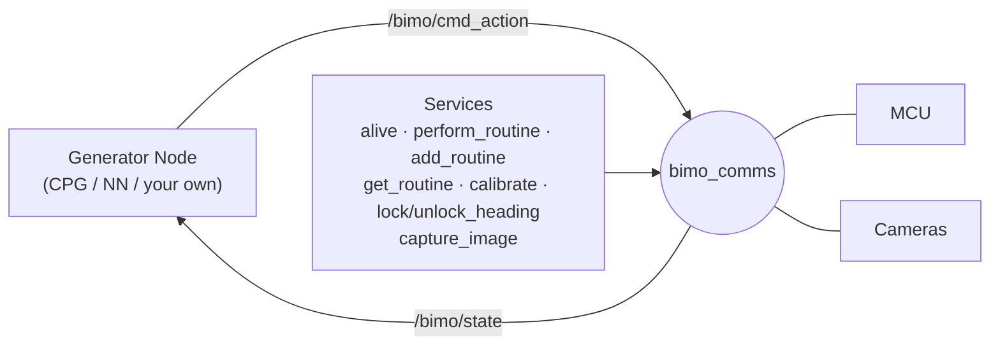

# Bimo ROS2 Package

ROS2 wrapper around the Bimo Robotics Kit API. It exposes the robot as a graph of topics and services instead of a single Python script, so any number of nodes (CPG, RL policies, teleoperation, monitoring tools) can drive or observe the robot without touching hardware directly.

## Structure

A single node, `bimo_comms`, owns the one live connection to the robot (the MCU over serial, plus both cameras) and arbitrates every access to it through a priority-ordered worker thread. Nothing else in the graph talks to `/dev/ttyACM*` or `/dev/video*` directly. Everything else is a plain ROS2 topic or service call into this node.



Action commands get top priority over the periodic state poll, so a generator node's output is never stuck waiting behind a routine sensor read. Long-running operations (`perform_routine`, `calibrate`) run on a separate callback path so the rest of the node stays responsive. While long-running operations execute, any `cmd_action` message received is dropped with a logged warning rather than silently applied late.

This design deliberately keeps `bimo_comms` as the *only* officially shipped node. The control loop itself (how actions get generated) is left to you: `examples/` includes a CPG-based walker and an ONNX policy walker as reference implementations, not as the definitive way to drive the robot.

## Package Layout

```
ROS2/
├── src/
│   ├── bimo_ros2/
│   │   ├── bimo_ros2/
│   │   │   ├── comms_node.py
│   │   │   ├── bimo_core.py       # same Bimo class as the standalone API
│   │   │   ├── routines.py        # same BimoRoutines class as the standalone API
│   │   │   ├── cpg.py             # same BimoCPG class as the standalone API
│   │   │   └── examples/
│   │   │       ├── cpg_walk_node.py
│   │   │       └── nn_walk_node.py
│   │   ├── launch/bimo_comms.launch.py
│   │   ├── setup.py
│   │   └── package.xml
│   └── bimo_ros2_msgs/             # custom msg/srv definitions
│       ├── msg/
│       ├── srv/
│       └── CMakeLists.txt
└── README.md
```

## Installation

Install ROS2 for your system first. Follow the official instructions for your Linux version at [docs.ros.org](https://docs.ros.org) (Humble for 22.04/Jammy-based systems, Jazzy for 24.04/Noble-based systems, including their respective Linux Mint equivalents).

> On Linux Mint, `rosdep` doesn't recognize the OS by default. Pass `--os=ubuntu:<codename>` explicitly on every `rosdep install` call below, matching your actual Ubuntu base (check with `. /etc/os-release && echo $UBUNTU_CODENAME`).

Clone this repo, then build the ROS2 workspace:

```bash
cd ROS2
rosdep install --from-paths src --ignore-src -y --os=ubuntu:jammy --skip-keys="ament_python"
colcon build --symlink-install
source /opt/ros/humble/setup.bash
source install/setup.bash
```

Additional Python dependencies for the NN example (not covered by `rosdep`, install into the same Python environment your ROS2 install uses, see **Troubleshooting** if this trips you up):

```bash
python3 -m pip install --user onnxruntime
```

## Running

Bring up the comms node with either `ros2 run` or `ros2 launch` **they are equally valid**, but only `ros2 run` gives the process a real terminal stdin/stdout:

```bash
# Recommended default. Required if you'll ever call /bimo/calibrate
ros2 run bimo_ros2 bimo_comms

# Also valid, but calibrate's interactive prompts won't work through this
ros2 launch bimo_ros2 bimo_comms.launch.py
```

> `ros2 launch` pipes and buffers the child process's stdio, so `bimo.calibrate()`'s `input()` prompts either print late or never receive your keystrokes at all. Use `ros2 launch` for scripted or multi-node startups where calibration won't be triggered in that session. Use `ros2 run` whenever you need it.

## Services

| Service | Type | Description |
| :-- | :-- | :-- |
| `/bimo/alive` | `std_srvs/Trigger` | Checks whether the MCU is connected and responding. |
| `/bimo/perform_routine` | `bimo_ros2_msgs/PerformRoutine` | Executes a named routine (`"stand"`, `"sit"`, or any custom one). Blocks other actions until it completes. |
| `/bimo/add_routine` | `bimo_ros2_msgs/AddRoutine` | Registers a new named routine as a list of 8-joint pose steps. |
| `/bimo/get_routine` | `bimo_ros2_msgs/GetRoutine` | Returns the stored steps of an already-registered routine. |
| `/bimo/calibrate` | `std_srvs/Trigger` | Runs the interactive servo calibration process. Requires `ros2 run` (see above). |
| `/bimo/lock_heading` | `std_srvs/Trigger` | Sets the current yaw as the heading reference. |
| `/bimo/unlock_heading` | `std_srvs/Trigger` | Clears the heading reference, restoring raw IMU yaw. |
| `/bimo/capture_image` | `bimo_ros2_msgs/CaptureImage` | Captures a single frame from `"front"` or `"top"` camera as a `sensor_msgs/Image` (see `nn_walk_node.py` for usage example). |

## Topics

| Topic | Type | Direction | Description |
| :-- | :-- | :-- | :-- |
| `/bimo/state` | `bimo_ros2_msgs/StateData` | published by `bimo_comms` | Full robot state (orientation, distances, servo feedback, etc.), broadcast continuously. |
| `/bimo/cmd_action` | `bimo_ros2_msgs/ActionCommand` | subscribed by `bimo_comms` | 8 joint positions in degrees. Dropped with a logged warning if a routine or calibration is in progress. |

```bash
ros2 service call /bimo/perform_routine bimo_ros2_msgs/srv/PerformRoutine "{name: 'stand'}"
ros2 topic pub --once /bimo/cmd_action bimo_ros2_msgs/msg/ActionCommand "{positions: [-30,-30,0,0,60,60,30,30]}"
```

> WARNING: double-check any manual command against the robot's current pose before sending it. A standing pose sent while the robot is sitting will make it launch itself backwards!

## Examples

Two reference generator nodes ship in `examples/`, each publishing to `/bimo/cmd_action` and subscribing to `/bimo/state`. Both stand the robot up and lock heading automatically before they start moving. **Run only one at a time.**

**CPG Walker:** a Fourier-series gait generator with startup ramp-up and heading-based turn correction:
```bash
ros2 run bimo_ros2 cpg_walk_node
```

**NN Policy Walker**: ONNX inference loop, that saves a debug snapshot from both cameras at startup as example:
```bash
ros2 run bimo_ros2 nn_walk_node --ros-args \
  -p model_path:=/absolute/path/to/policy.onnx \
  -p image_output_dir:=/tmp/bimo_captures
```

Neither is meant to be the definitive control loop. You can write your own generator node against `/bimo/cmd_action` and `/bimo/state` for anything beyond these two.

## Registering Custom Routines

Equivalent to `bimo.routines.add_routine()` in the standalone API, but through the comms node so it applies to whichever generator node or tool is currently connected:

```bash
ros2 service call /bimo/add_routine bimo_ros2_msgs/srv/AddRoutine \
  "{name: 'wobble', steps: [{positions: [-32,-32,0,0,60,60,30,30]}, {positions: [-28,-28,0,0,60,60,30,30]}]}"
ros2 service call /bimo/perform_routine bimo_ros2_msgs/srv/PerformRoutine "{name: 'wobble'}"
```

## Troubleshooting

- **`ros-<distro>-desktop` package not found**: your ROS2 distro must match your actual Ubuntu base, not just "the latest ROS2 release." Check with `. /etc/os-release && echo $UBUNTU_CODENAME` and install the matching distro (Humble for `jammy`, Jazzy for `noble`).

- **`rosdep`: Unsupported OS \[mint\]**: pass `--os=ubuntu:<codename>` explicitly on every `rosdep install` call.

- **`rosdep`: Cannot locate rosdep definition for `[ament_python]`**: add `--skip-keys="ament_python"`. The tooling is already installed via `ros-dev-tools`, rosdep just can't resolve that specific key.

- **`ModuleNotFoundError` for a pip package (e.g. `onnxruntime`)**: install it into the same Python interpreter your ROS2 install uses (`python3 -m pip install --user <package>`), a separately activated virtualenv won't be picked up by `ros2 run`/`ros2 launch`, since the generated node scripts have their interpreter fixed at build time.

- **`/bimo/calibrate` hangs or prints nothing until you kill it**: you started `bimo_comms` with `ros2 launch`. Restart it with `ros2 run` instead (see **Running**, above).

- **Cannot connect to MCU / cameras not found**: same causes as the standalone API. Check `/dev/ttyACM*`/`/dev/video*` and permissions, confirm the RP2040 firmware is current, and confirm both cameras are connected before starting `bimo_comms`.

## License

Apache-2.0, matching the rest of the Bimo Project.


---